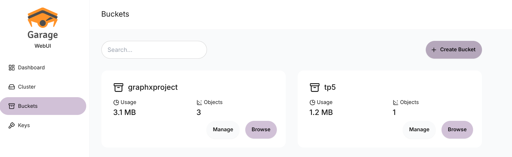
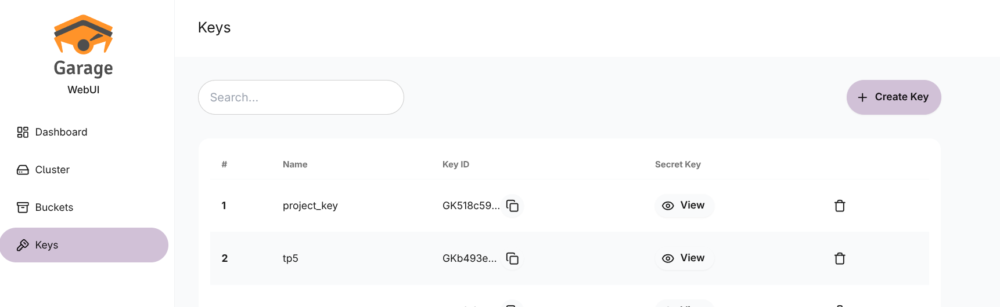
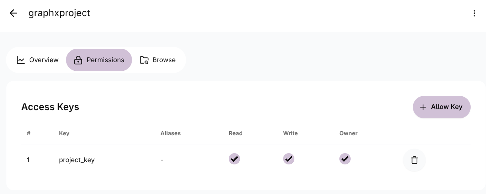

# GraphX_project

## ORGANISATION

- Requêtes API et stockage dans garage (setup.ipynb) : Florent
- Réaliser une requête en DATAFRAME en mode batch et présenter les résultats sous forme de graphique à l'aide de Pandas et Seaborn dont une requête à l'aide de SparkSQL (queries_dataframe.ipynb) : Titouan
- Effectuer au moins (plus que 1 si t'as pas la flemme chef) une requête en mode RDD (queries_rdd.ipynb): Théo
- effectuer deux requêtes différentes en mode batch et relier au Dashboard (streaming.ipynb) : Azim
- graphx (graphx.ipynb) : Paul

## Creer un nouveau bucket
1. Aller sur l'[UI Garage](http://localhost:3909)
2. Creer un nouveau bucket (Attention: il ne peut pas y avoir de caractère spécial et de majuscule dans le nom de bucket)

3. Ajouter une clé à associée avec ce bucket 
4. Associer les accès à cette clé en cliquant sur manage dans le bucket

5. Donner tous les accès à cette clé:

## Creer son environnement
1. Creer un fichier .env dans le projet
2. Ajouter 
    - `PRIM_API_KEY=<clé générée sur le site>`
    - `key_id` =<Garage API Key> # replace by your key id Garage Garage
    - `secret_key` = <Garage secret Key> # replace by your secret key from Garage
    - `minio_ip_address` = "garage"
    - `bucket_name` = <Nom du bucket créé>

## Lancer le setup
