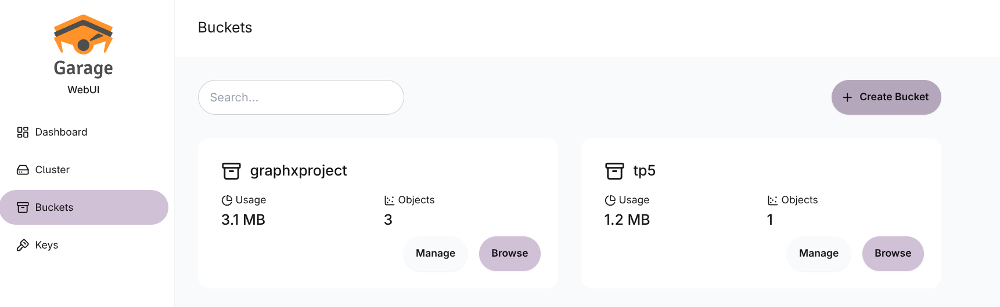
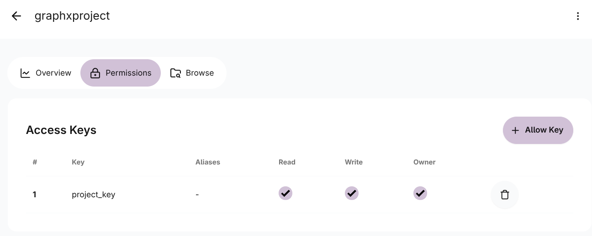

# GraphX_project

## Garage Bucket Setup
1. Aller sur l'[UI Garage](http://localhost:3909)
2. Créer un nouveau bucket (Attention: pas de caractère spécial ni de majuscule dans le nom)

3. Créer une nouvelle clé d'accès (section *Keys*)
4. Associer la clé au bucket: *Buckets -> Manage -> Permissions -> Allow key*
5. Donner tous les accès à cette clé:

## Creer son environnement
1. Créer un fichier .env dans le projet, en se basant sur le `.env.example`

2. Ajouter 
    - `PRIM_API_KEY=<clé générée sur le site>`
    - `key_id` =<Garage API Key> # replace by your key id Garage Garage
    - `secret_key` = <Garage secret Key> # replace by your secret key from Garage
    - `minio_ip_address` = "garage"
    - `bucket_name` = <Nom du bucket créé>

## Lancer le setup

Afin de charger les fichiers nécessaires dans Garage et ingérer les données temps réel dans Kafka: exécutez toutes les cellules du notebook [setup.ipynb](setup.ipynb)

PS: le service ingestor ne chargera oas 100% des données nécessaires.

## Requêtes batch

Vous les trouverez dans les notebooks [queries_rdd.ipynb](queries_rdd.ipynb) et [queries_dataframe.ipynb](queries_dataframe.ipynb)

Vous y trouverez également SparkSQL, les différents graphiques ainsi que quelques jointures.

## Requêtes streaming

Vous les trouverez dans [streaming.ipynb](streaming.ipynb)

## GraphX

GraphX est notre thématique d'approfondissement. Vous trouverez davantage d'informations dans le diaporama.

Les commandes et requêtes associées sont présentes dans [graphx.ipynb](graphx.ipynb)

## API et frontend

Pour faciliter la visualisation des résultats, nous avions pour ambition de créer un dashboard, qui fonctionnerait sur la base de requêtes HTTP faites sur une API backend.

Chaque requête HTTP déclencherait une requête Spark, dont le résultats serait ensuite retransmis au dashboard.

Cependant, nous avons rencontré de nombreuses difficultés notamment concernant le lancement des requêtes Spark: problèmes de worker, etc. Une approche asynchrone avec des résultats stockés dans Kafka aurait également dûe être favorisée. 

Pour ces raisons, le dashboard n'a pas été finalisé, et le coeur de nos requêtes se trouve toujours dans les notebooks cités précédemment.

